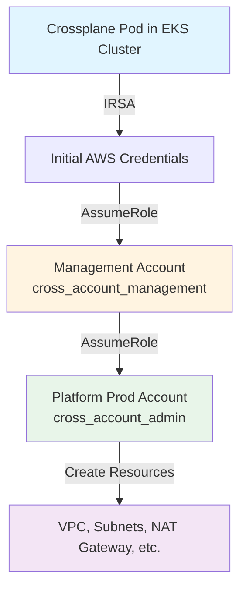

# VPC Deployment with Role Chaining Guide

## Architecture Overview

Your setup uses a **three-account role chaining** pattern:

```
EKS Cluster Account (IRSA)
  ↓ (assumes cross_account_management)
Management Account (873031875931)
  ↓ (assumes cross_account_admin)
Platform Prod Account (637423399955)
  ↓ (creates VPC resources)
```

## Provider Config: Already Configured

Your `platform-prod-account` provider config is already set up correctly:

**File**: `infra-definitions/shared/configs/provider-configs/platform-prod.yaml`

```yaml
---
apiVersion: aws.upbound.io/v1beta1
kind: ProviderConfig
metadata:
  name: platform-prod-account
spec:
  credentials:
    source: IRSA
  assumeRoleChain:
    - roleARN: arn:aws:iam::873031875931:role/cross_account_management
    - roleARN: arn:aws:iam::637423399955:role/cross_account_admin
```

**How it works:**
1. Crossplane pod uses IRSA (IAM Role for Service Accounts) in your EKS cluster
2. Assumes `cross_account_management` role in management account (873031875931)
3. From management account, assumes `cross_account_admin` role in platform-prod (637423399955)
4. Creates VPC resources in platform-prod account

## Step 1: Create VPC Claim for Platform Prod

Create a new VPC claim that references the `platform-prod-account` provider config:

**File**: `environments/prod/infrastructure/network/platform-prod-vpc.yaml`

```yaml
---
# Platform Production VPC using role chaining
# EKS Account (IRSA) -> Management Account -> Platform Prod Account
apiVersion: aws.plt.intelerad.io/v1alpha1
kind: VPCNetwork
metadata:
  name: platform-prod-shared-vpc
  namespace: default
spec:
  parameters:
    # VPC Configuration
    vpcCidr: 10.100.0.0/16
    region: us-east-2
    availabilityZones:
      - us-east-2a
      - us-east-2b
      - us-east-2c

    # Public Subnets (for ALB, NAT Gateway, etc.)
    publicSubnets:
      - name: prod-shared-public-a
        cidr: 10.100.0.0/20      # 10.100.0.0 - 10.100.15.255
        az: us-east-2a
        mapPublicIpOnLaunch: true
      - name: prod-shared-public-b
        cidr: 10.100.16.0/20     # 10.100.16.0 - 10.100.31.255
        az: us-east-2b
        mapPublicIpOnLaunch: true
      - name: prod-shared-public-c
        cidr: 10.100.32.0/20     # 10.100.32.0 - 10.100.47.255
        az: us-east-2c
        mapPublicIpOnLaunch: true

    # Private Subnets (for EKS nodes, RDS, etc.)
    privateSubnets:
      - name: prod-shared-private-a
        cidr: 10.100.48.0/20     # 10.100.48.0 - 10.100.63.255
        az: us-east-2a
      - name: prod-shared-private-b
        cidr: 10.100.64.0/20     # 10.100.64.0 - 10.100.79.255
        az: us-east-2b
      - name: prod-shared-private-c
        cidr: 10.100.80.0/20     # 10.100.80.0 - 10.100.95.255
        az: us-east-2c

    # NAT Gateway Configuration
    # ⚠️ NAT Gateway costs ~$0.045/hour + data transfer charges
    natGateway:
      enabled: true
      publicSubnetName: prod-shared-public-a
      allocateElasticIp: true

    # Tags for resource organization
    tags:
      managedBy: Crossplane
      project: portal-kombat
      environment: production
      additional:
        CostCenter: platform-networking
        Compliance: "true"

    # ⚠️ CRITICAL: Use platform-prod-account provider config for role chaining
    providerConfig: platform-prod-account

  # Connection secret stores VPC ID and subnet IDs for use by other resources
  writeConnectionSecretToRef:
    name: platform-prod-vpc-connection
    namespace: crossplane-system
```

## Step 2: Deploy the VPC

### Option A: Using ArgoCD (Recommended for GitOps)

1. **Commit to Git:**
   ```bash
   git add environments/prod/infrastructure/network/platform-prod-vpc.yaml
   git commit -m "feat: add platform prod VPC with role chaining"
   git push
   ```

2. **Watch ArgoCD sync:**
   ```bash
   # Check application sync status
   kubectl get applications -n argocd | grep infrastructure

   # Watch sync progress
   kubectl get applications -n argocd -w

   # Force sync if needed
   kubectl patch application prod-infrastructure-claims -n argocd \
     --type merge -p '{"operation":{"initiatedBy":{"username":"admin"},"sync":{}}}'
   ```

### Option B: Direct kubectl Apply (For Testing)

```bash
# Apply the VPC claim directly
kubectl apply -f environments/prod/infrastructure/network/platform-prod-vpc.yaml

# Watch the VPC creation
kubectl get vpcnetwork platform-prod-shared-vpc -w

# Check detailed status
kubectl describe vpcnetwork platform-prod-shared-vpc
```

## Step 3: Verify Role Chaining

### Check Crossplane Logs for Role Assumptions

```bash
# Check provider-aws-ec2 logs (handles VPC resources)
kubectl logs -n crossplane-system -l pkg.crossplane.io/provider=provider-aws-ec2 --tail=50 | grep -i assume

# You should see role assumption chains like:
# Assuming role: arn:aws:iam::873031875931:role/cross_account_management
# Assuming role: arn:aws:iam::637423399955:role/cross_account_admin
```

### Verify Resource Creation in AWS

```bash
# Set AWS_PROFILE to platform-prod account
export AWS_PROFILE=ims-platform-prod  # Adjust to your profile name

# Check VPC creation in platform-prod account
aws ec2 describe-vpcs \
  --region us-east-2 \
  --filters "Name=tag:Project,Values=portal-kombat" "Name=tag:Environment,Values=production"

# Check subnets
aws ec2 describe-subnets \
  --region us-east-2 \
  --filters "Name=tag:ManagedBy,Values=Crossplane"

# Check NAT Gateway
aws ec2 describe-nat-gateways \
  --region us-east-2 \
  --filter "Name=tag:Environment,Values=production"
```

## Step 4: Troubleshooting

### Problem: VPC Not Creating

1. **Check resource status:**
   ```bash
   kubectl get vpcnetwork platform-prod-shared-vpc -o yaml
   ```

2. **Check events:**
   ```bash
   kubectl get events -n default --sort-by='.lastTimestamp' | grep platform-prod-shared-vpc
   ```

3. **Check provider health:**
   ```bash
   kubectl get providers
   kubectl describe provider provider-aws-ec2
   ```

### Problem: Role Assumption Failures

**Check IAM trust relationships:**

```bash
# In Management Account (873031875931)
aws iam get-role --role-name cross_account_management --query 'Role.AssumeRolePolicyDocument'

# Should trust your EKS cluster's IRSA role

# In Platform Prod Account (637423399955)
aws iam get-role --role-name cross_account_admin --query 'Role.AssumeRolePolicyDocument'

# Should trust management account's cross_account_management role
```

**Check provider logs for errors:**
```bash
kubectl logs -n crossplane-system -l pkg.crossplane.io/provider=provider-aws-ec2 | grep -i "error\|denied\|unauthorized"
```

### Problem: Permission Errors

**Verify IAM permissions in platform-prod account:**

```bash
# cross_account_admin role needs these permissions:
# - ec2:CreateVpc, ec2:DescribeVpcs, ec2:ModifyVpcAttribute
# - ec2:CreateSubnet, ec2:DescribeSubnets
# - ec2:CreateInternetGateway, ec2:AttachInternetGateway
# - ec2:CreateRouteTable, ec2:CreateRoute
# - ec2:AllocateAddress, ec2:CreateNatGateway
# - ec2:CreateTags

aws iam get-role-policy \
  --role-name cross_account_admin \
  --policy-name CrossplaneEC2Policy \
  --profile ims-platform-prod
```

## Step 5: Verify Connection Secret

The VPC composition creates a connection secret with VPC and subnet IDs:

```bash
# Check secret exists
kubectl get secret platform-prod-vpc-connection -n crossplane-system

# View secret contents (base64 decode)
kubectl get secret platform-prod-vpc-connection -n crossplane-system -o jsonpath='{.data.vpcId}' | base64 -d
kubectl get secret platform-prod-vpc-connection -n crossplane-system -o jsonpath='{.data.publicSubnetIds}' | base64 -d
kubectl get secret platform-prod-vpc-connection -n crossplane-system -o jsonpath='{.data.privateSubnetIds}' | base64 -d
```

## Role Chaining Flow Summary



## Key Points

1. **Provider Config Selection**: Always use `providerConfig: platform-prod-account` in your claim spec
2. **Role Chain Order**: IRSA → Management → Platform Prod (defined in ProviderConfig)
3. **IAM Trust Policies**: Each role must trust the previous role in the chain
4. **Permissions**: The final role (cross_account_admin) needs EC2 permissions in platform-prod
5. **Verification**: Check AWS console in platform-prod (637423399955) to confirm resources

## Additional Resources

- [AWS IAM Role Chaining](https://docs.aws.amazon.com/IAM/latest/UserGuide/id_roles_terms-and-concepts.html#iam-term-role-chaining)
- [Crossplane AWS Provider Docs](https://marketplace.upbound.io/providers/upbound/provider-aws/)
- [IRSA Setup Guide](https://docs.aws.amazon.com/eks/latest/userguide/iam-roles-for-service-accounts.html)
