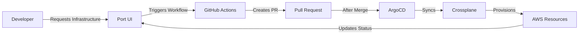

# Port.io Integration

This directory contains Port.io configuration for infrastructure self-service in Portal Kombat.

## Directory Structure

```
port/
├── blueprints/           # Data model definitions
│   ├── xrd.json
│   ├── composition.json
│   ├── infrastructure-claim.json
│   └── argocd-app.json
├── actions/              # Self-service action definitions
│   ├── create-s3-bucket.json
│   └── create-transit-gateway.json
├── catalog/              # Initial catalog data
│   ├── platform-xrds.yml
│   ├── compositions.yml
│   └── argocd-apps.yml
└── README.md

.github/workflows/        # GitHub workflows triggered by Port
├── port-create-s3-bucket.yml
└── port-create-transit-gateway.yml
```

## Quick Links

- **Setup Guide**: [docs/PORT_SETUP.md](../docs/PORT_SETUP.md)
- **Developer Guide**: [docs/PORT_DEVELOPER_GUIDE.md](../docs/PORT_DEVELOPER_GUIDE.md)
- **Port App**: [https://app.getport.io](https://app.getport.io)

## What is Port?

Port.io is an internal developer portal that provides:

1. **Software Catalog**: Centralized view of all infrastructure
2. **Self-Service Actions**: Developer portal for requesting infrastructure
3. **Scorecards**: Quality standards for infrastructure
4. **Automation**: GitHub workflows for GitOps provisioning

## How It Works



## Blueprints

Blueprints define the data model for your infrastructure catalog.

### Available Blueprints

| Blueprint | Description | File |
|-----------|-------------|------|
| **xrd** | Crossplane XRD definitions | `blueprints/xrd.json` |
| **composition** | Crossplane Composition implementations | `blueprints/composition.json` |
| **infrastructureClaim** | Infrastructure resource claims | `blueprints/infrastructure-claim.json` |
| **argocdApp** | ArgoCD Applications | `blueprints/argocd-app.json` |

### Blueprint Relationships

```
xrd (1) ←─── (N) composition
              │
              └──→ (N) infrastructureClaim
                    │
                    └──→ (1) argocdApp
```

## Actions

Self-service actions allow developers to request infrastructure through Port's UI.

### Available Actions

| Action | Description | Workflow | Approval Required |
|--------|-------------|----------|-------------------|
| **Request S3 Bucket** | Create S3 bucket for storage | `port-create-s3-bucket.yml` | No (dev), Yes (prod) |
| **Request Transit Gateway** | Create Transit Gateway for networking | `port-create-transit-gateway.yml` | No (dev), Yes (prod) |

### How Actions Work

1. **Developer** fills form in Port UI
2. **Port** triggers GitHub workflow with form data
3. **Workflow** creates infrastructure YAML files
4. **Workflow** opens Pull Request
5. **Platform Team** reviews and merges (or auto-merges for dev)
6. **ArgoCD** syncs changes
7. **Crossplane** provisions AWS resources
8. **Port** updates entity status

## Catalog

The catalog contains initial entities to populate Port with existing infrastructure.

### Catalog Files

- `platform-xrds.yml`: XRD definitions (ObjectStorage, TransitGateway, EKS)
- `compositions.yml`: Composition implementations
- `argocd-apps.yml`: ArgoCD application hierarchy

### Syncing Catalog

**Automatic (Recommended):**
- Configure Port GitHub integration to watch `**/port.yml` files
- Port auto-discovers and syncs entities from Git

**Manual:**
- Use Port API to import catalog files
- See [docs/PORT_SETUP.md](../docs/PORT_SETUP.md) for instructions

## Configuration

### Required Secrets

Add these secrets to your GitHub repository:

```bash
PORT_CLIENT_ID=<your-port-client-id>
PORT_CLIENT_SECRET=<your-port-client-secret>
```

### Required Permissions

Port GitHub App needs:
- **Read** access to code
- **Read/Write** access to pull requests
- **Read** access to workflows

### Repository Settings

Update these values in action files:

```json
{
  "invocationMethod": {
    "identifier": "ims-platform-dev/portal-kombat"        // ← Change this if different
  }
}
```
 echo "Importing action from $action_file..."


 sed "s/ims-platform-dev/YOUR_GITHUB_USERNAME/g" "$action_file" | curl -X POST https://api.us.port.io/v1/actions -H "Authorization: Bearer $ACCESS_TOKEN" -H "Content-Type: application/json" -d @-
done
## Usage Examples

### Request S3 Bucket

**Via Port UI:**
1. Go to Self-Service → Request S3 Bucket
2. Fill form:
   - Bucket Name: `portal-kombat-dev-myapp-12345`
   - Environment: `dev`
   - Region: `us-east-2`
   - Purpose: `application-data`
3. Click Execute

**Result:**
- PR created with:
  - `environments/dev/infrastructure/storage/portal-kombat-dev-myapp-12345.yaml`
  - `environments/dev/infrastructure/storage/portal-kombat-dev-myapp-12345-port.yml`

### Request Transit Gateway

**Via Port UI:**
1. Go to Self-Service → Request Transit Gateway
2. Fill form:
   - TGW Name: `hub-tgw`
   - Environment: `dev`
   - ASN: `64512`
3. Click Execute

**Result:**
- PR created with:
  - `environments/dev/infrastructure/routing/transit-gateways/hub-tgw.yaml`
  - `environments/dev/infrastructure/routing/transit-gateways/hub-tgw-port.yml`

## Development

### Adding New Action

1. **Create GitHub Workflow**:
```yaml
# .github/workflows/port-create-rds.yml
name: Create RDS from Port
on:
  workflow_dispatch:
    inputs:
      port_context:
        required: true
        type: string

jobs:
  create-rds:
    runs-on: ubuntu-latest
    steps:
      # Parse Port context
      # Create infrastructure YAML
      # Create Port YAML
      # Open PR
```

2. **Create Action Definition**:
```json
// port/actions/create-rds.json
{
  "identifier": "create_rds",
  "title": "Request RDS Database",
  "trigger": {
    "type": "self-service",
    "userInputs": {
      "properties": {
        "dbName": { "type": "string" },
        "engine": { "enum": ["postgres", "mysql"] }
      }
    }
  },
  "invocationMethod": {
    "type": "GITHUB",
    "workflow": "port-create-rds.yml"
  }
}
```

3. **Import Action to Port**:
```bash
curl -X POST https://api.getport.io/v1/actions \
  -H "Authorization: Bearer $ACCESS_TOKEN" \
  -d @port/actions/create-rds.json
```

### Testing Actions Locally

Test GitHub workflow locally using `act`:

```bash
# Install act
brew install act

# Create test payload
cat > test-payload.json <<EOF
{
  "port_context": "{\"payload\":{\"properties\":{\"bucketName\":\"test-bucket\",\"environment\":\"dev\"}},\"context\":{\"runId\":\"test-123\"}}"
}
EOF

# Run workflow
act workflow_dispatch \
  -W .github/workflows/port-create-s3-bucket.yml \
  -e test-payload.json \
  --secret PORT_CLIENT_ID=$PORT_CLIENT_ID \
  --secret PORT_CLIENT_SECRET=$PORT_CLIENT_SECRET
```

## Troubleshooting

### Common Issues

**1. Workflow Not Triggering**
- Verify Port GitHub App is installed
- Check workflow file exists in `.github/workflows/`
- Verify repository permissions

**2. Entity Not Created**
- Check `port.yml` file syntax
- Verify blueprint exists in Port
- Manually trigger resync in Port UI

**3. PR Creation Fails**
- Check GitHub token permissions
- Verify branch doesn't already exist
- Check for merge conflicts

### Debug Commands

```bash
# Check ArgoCD sync
kubectl get application dev-infrastructure-claims -n argocd

# Check Crossplane resource
kubectl describe objectstorage <name>

# Check provider logs
kubectl logs -n crossplane-system -l pkg.crossplane.io/provider=provider-aws-s3

# Check GitHub Actions
gh run list --workflow=port-create-s3-bucket.yml
gh run view <run-id> --log
```

## Resources

- [Port Documentation](https://docs.port.io/)
- [Port API Reference](https://docs.port.io/api-reference/)
- [Port GitHub App](https://github.com/apps/port-io)
- [GitHub Actions Syntax](https://docs.github.com/en/actions/using-workflows/workflow-syntax-for-github-actions)

## Support

- **Platform Team**: #platform-team (Slack)
- **GitHub Issues**: Open issue in portal-kombat repo
- **Port Support**: help@getport.io
